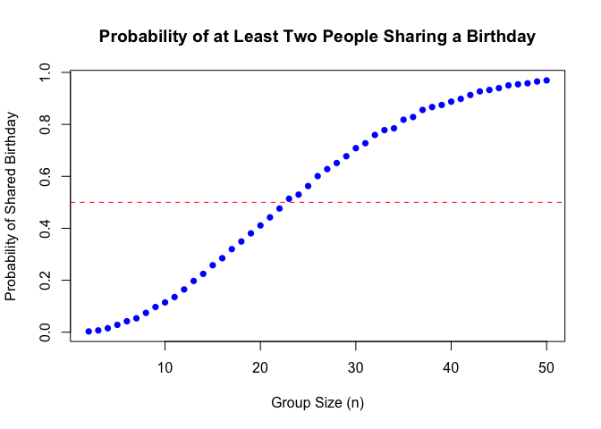

p8105_hw5_hl3859
================
Hanrui Li
2024-11-13

# Problem 1

``` r
has_duplicate = function(n) {
  bdays = sample(1:365, n, replace = TRUE) 
  return(any(duplicated(bdays))) 
}

simulate_probs = function(trials = 10000, max_size = 50) {
  probs = numeric(max_size - 1)
  
  for (n in 2:max_size) {
    dup_count = sum(replicate(trials, has_duplicate(n)))
    probs[n - 1] = dup_count / trials
  }
  
  return(probs)
}

probs = simulate_probs()

group_sizes = 2:50
plot(group_sizes, probs, type = "b", 
     xlab = "Group Size (n)", 
     ylab = "Probability of Shared Birthday",
     main = "Probability of at Least Two People Sharing a Birthday",
     pch = 16, col = "blue")
abline(h = 0.5, col = "red", lty = 2)
```

<!-- -->

The probability of shared birthdays increases as the group size
increases. The probability reaches around 0.5 when the group size is
about 23. By the time the group size reaches 50, the probability of a
shared birthday is close to 1, meaning it’s almost certain that at least
two people will share a birthday in such a group.

# Problem 2

``` r
library(dplyr)
library(broom)
library(ggplot2)
```

``` r
n = 30
sigma = 5
alpha = 0.05
mu_values = 0:6
num_simulations = 5000

results <- data.frame(mu = numeric(), estimate = numeric(), p_value = numeric())

set.seed(1)

for (mu in mu_values) {
  for (i in 1:num_simulations) {

    sample <- rnorm(n, mean = mu, sd = sigma)
    
    t_test <- t.test(sample, mu = 0)
    test_summary <- tidy(t_test)
    
    results <- rbind(
      results, data.frame(mu = mu, estimate = test_summary$estimate, p_value = test_summary$p.value))
  }
}

power_data =
  results |>
  group_by(mu) |>
  summarize(power = mean(p_value < alpha))

power_data |>
  ggplot(aes(x = mu, y = power)) +
  geom_line() +
  geom_point() +
  labs(title = "Power vs. Effect Size", x = expression(mu), y = "Power") +
  theme_minimal()
```

<!-- -->

The association between effect size and power is positive and nonlinear.
As the effect size grows, the power of the test improves, but beyond a
certain point, additional increases in effect size have a diminishing
impact on power.

``` r
average_mu_data =
  results |>
  group_by(mu) |>
  summarize(average_estimate = mean(estimate))

rejected_mu_data =
  results |>
  filter(p_value < alpha) |>
  group_by(mu) |>
  summarize(rejected_average_estimate = mean(estimate))

ggplot() +
  geom_line(data = average_mu_data, aes(x = mu, y = average_estimate), color = "blue") +
  geom_point(data = average_mu_data, aes(x = mu, y = average_estimate), color = "blue") +
  geom_line(data = rejected_mu_data, aes(x = mu, y = rejected_average_estimate), color = "red") +
  geom_point(data = rejected_mu_data, aes(x = mu, y = rejected_average_estimate), color = "red") +
  labs(title = "Average Estimate of Mu vs. True Mu",
       x = expression(mu),
       y = "Average Estimate of Mu",
       caption = "Blue: All Samples, Red: Null Rejected Samples") +
  theme_minimal()
```

<!-- -->

the sample average of $\hat{\mu}$ across tests where the null is
rejected does not approximate the true value of $\mu$ well at lower
effect sizes. The red line provides a biased estimate of $\mu$ at lower
values. This is because when the null hypothesis is rejected, it often
indicates that the sample mean was sufficiently far from zero (the null
value), thus creating a selection bias. This bias causes the average
$\hat{\mu}$ in the rejected samples to overestimate the true $\mu$,
especially when $\mu$ is small.

However, as $\mu$ increases, the effect size becomes large enough that
most tests reject the null hypothesis, reducing this selection bias.
This is why, at higher $\mu$ values, the red line closely approximates
the true $\mu$.

# Problem 3

``` r
library(tidyverse)
```

    ## ── Attaching core tidyverse packages ──────────────────────── tidyverse 2.0.0 ──
    ## ✔ forcats   1.0.0     ✔ stringr   1.5.1
    ## ✔ lubridate 1.9.3     ✔ tibble    3.2.1
    ## ✔ purrr     1.0.2     ✔ tidyr     1.3.1
    ## ✔ readr     2.1.5     
    ## ── Conflicts ────────────────────────────────────────── tidyverse_conflicts() ──
    ## ✖ dplyr::filter() masks stats::filter()
    ## ✖ dplyr::lag()    masks stats::lag()
    ## ℹ Use the conflicted package (<http://conflicted.r-lib.org/>) to force all conflicts to become errors

``` r
homicide = 
  read.csv("homicide-data.csv") |>
  mutate(city_state = paste(city, state, sep = ", "))

homicide_summary = 
  homicide |>
  group_by(city_state) |>
  summarise(
    total_homicides = n(),
    unsolved_homicides = sum(disposition %in% c("Closed without arrest", "Open/No arrest"))
  )

homicide_summary
```

    ## # A tibble: 51 × 3
    ##    city_state      total_homicides unsolved_homicides
    ##    <chr>                     <int>              <int>
    ##  1 Albuquerque, NM             378                146
    ##  2 Atlanta, GA                 973                373
    ##  3 Baltimore, MD              2827               1825
    ##  4 Baton Rouge, LA             424                196
    ##  5 Birmingham, AL              800                347
    ##  6 Boston, MA                  614                310
    ##  7 Buffalo, NY                 521                319
    ##  8 Charlotte, NC               687                206
    ##  9 Chicago, IL                5535               4073
    ## 10 Cincinnati, OH              694                309
    ## # ℹ 41 more rows

``` r
prop.test(
  homicide_summary |> 
    filter(city_state == "Baltimore, MD") |> 
    pull(unsolved_homicides), 
  homicide_summary |> 
    filter(city_state == "Baltimore, MD") |> 
    pull(total_homicides)) |>
  broom::tidy()
```

    ## # A tibble: 1 × 8
    ##   estimate statistic  p.value parameter conf.low conf.high method    alternative
    ##      <dbl>     <dbl>    <dbl>     <int>    <dbl>     <dbl> <chr>     <chr>      
    ## 1    0.646      239. 6.46e-54         1    0.628     0.663 1-sample… two.sided

``` r
results = homicide_summary |>
  mutate(
    prop_test = purrr::map2(unsolved_homicides, total_homicides, ~ prop.test(.x, .y)),
    tidy_results = purrr::map(prop_test, ~broom::tidy(.x))) |>
  unnest(tidy_results) |>
  select(city_state, estimate, conf.low, conf.high)
```

    ## Warning: There was 1 warning in `mutate()`.
    ## ℹ In argument: `prop_test = purrr::map2(...)`.
    ## Caused by warning in `prop.test()`:
    ## ! Chi-squared approximation may be incorrect

``` r
results
```

    ## # A tibble: 51 × 4
    ##    city_state      estimate conf.low conf.high
    ##    <chr>              <dbl>    <dbl>     <dbl>
    ##  1 Albuquerque, NM    0.386    0.337     0.438
    ##  2 Atlanta, GA        0.383    0.353     0.415
    ##  3 Baltimore, MD      0.646    0.628     0.663
    ##  4 Baton Rouge, LA    0.462    0.414     0.511
    ##  5 Birmingham, AL     0.434    0.399     0.469
    ##  6 Boston, MA         0.505    0.465     0.545
    ##  7 Buffalo, NY        0.612    0.569     0.654
    ##  8 Charlotte, NC      0.300    0.266     0.336
    ##  9 Chicago, IL        0.736    0.724     0.747
    ## 10 Cincinnati, OH     0.445    0.408     0.483
    ## # ℹ 41 more rows

``` r
results |>
  ggplot(aes(x = reorder(city_state, estimate), y = estimate)) +
  geom_point() +
  geom_errorbar(aes(ymin = conf.low, ymax = conf.high)) +
  labs(
    x = "City",
    y = "Proportion of Unsolved Homicides",
    title = "Proportion of Unsolved Homicides with 95% Confidence Intervals") + 
  theme(axis.text.x = element_text(angle = 90, vjust = 0.5, hjust = 1))
```

<!-- -->
